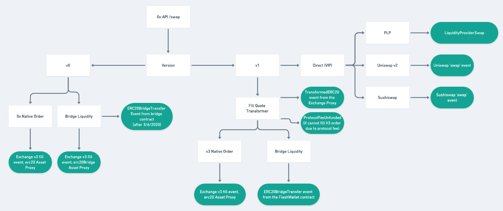
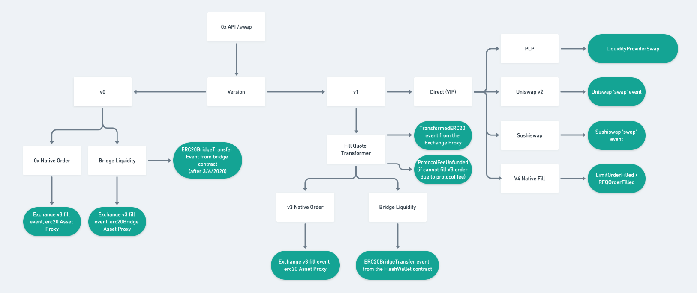
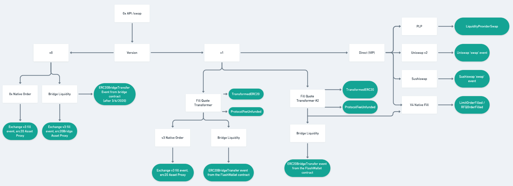

###############################
Releases
###############################

.. role:: strike
    :class: strike

This page outlines upcoming releases and expected changes.

+-------------+----------------------+-----------------------------------------+
| **Release** | **Est Release Date** | **Status**                              |
+-------------+----------------------+-----------------------------------------+
| `Tinker`_   | 11/12/20             | Deployed on 11/13/20.                   |
+-------------+----------------------+-----------------------------------------+
| `Tailor`_   | 11/18/20             | In audits.                              |
+-------------+----------------------+-----------------------------------------+
| `Soldier`_  | 12/07/20             | Code review.                            |
+-------------+----------------------+-----------------------------------------+
| `Sailor`_   | 12/07/20             | Under development.                      |
+-------------+----------------------+-----------------------------------------+
Tinker
------

- :strike:`Upgrade features to allow allowances set on the ExhcangeProxy contract. This will fallback to the Allowance Target.` (Moved to Sailor)
- Deploy VIP PLP feature. This introduces a new event that is emitted by the Exchange Proxy when filling through the VIP PLP.

.. code-block:: solidity

    event LiquidityProviderSwap(
        address inputToken,
        address outputToken,
        uint256 inputTokenAmount,
        uint256 outputTokenAmount,
        address provider,
        address recipient
    );

Tailor
------
- PLP instances will no longer emit `ERC20BridgeTransfer` events.

Soldier
-------
- Deploy feature that implements V4 Limit and RFQ orders (see the `Orders Page <../basics/orders.html>`_).
  This enables us to fill V4 limit orders through the Exchange Proxy, but does not yet allow aggregation.
- New events will be introduced.  The proposed events are below.

.. code-block:: solidity

    /// @dev Emitted whenever a `LimitOrder` is filled.
    /// @param orderHash The canonical hash of the order.
    /// @param maker The maker of the order.
    /// @param taker The taker of the order.
    /// @param feeRecipient Fee recipient of the order.
    /// @param takerTokenFilledAmount How much taker token was filled.
    /// @param makerTokenFilledAmount How much maker token was filled.
    /// @param pool The fee pool associated with this order.
    event LimitOrderFilled(
        bytes32 orderHash,
        address maker,
        address taker,
        address feeRecipient,
        address makerToken,
        address takerToken,
        uint128 takerTokenFilledAmount,
        uint128 makerTokenFilledAmount,
        uint128 takerFeeAmount,
        uint128 protocolFeePaid,
        bytes32 pool
    );

    /// @dev Emitted whenever an `RfqOrder` is filled.
    /// @param orderHash The canonical hash of the order.
    /// @param maker The maker of the order.
    /// @param taker The taker of the order.
    /// @param takerTokenFilledAmount How much taker token was filled.
    /// @param makerTokenFilledAmount How much maker token was filled.
    /// @param pool The fee pool associated with this order.
    event RfqOrderFilled(
        bytes32 orderHash,
        address maker,
        address taker,
        address makerToken,
        address takerToken,
        uint128 takerTokenFilledAmount,
        uint128 makerTokenFilledAmount,
        uint128 takerFeeAmount,
        uint128 protocolFeePaid,
        bytes32 pool
    );

    /// @dev Emitted whenever a limt or RFQ order is cancelled.
    /// @param orderHash The canonical hash of the order.
    event OrderCancelled(
        bytes32 orderHash
    );

    /// @dev Emitted whenever limit or RFQ orders are cancelled by pair by a maker.
    /// @param maker The maker of the order.
    /// @param makerToken The maker token in a pair for the orders cancelled.
    /// @param takerToken The taker token in a pair for the orders cancelled.
    /// @param minValidSalt The new minimum valid salt an order with this pair must
    ///        have.
    event PairOrdersUpToCancelled(
        address maker,
        address makerToken,
        address takerToken,
        uint256 minValidSalt
    );

Sailor
------
- A new transformer (like FillQuoteTransformer) that aggregates V4 orders instead of forwarding to Exchange V3.
- This enables us to run simbot trials against V4 before the external audit begins.
- WE DO NOT expect teams to be upgraded to V4 at this point; they can continue using the existing FillQuoteTransformer.
  At this point teams can begin testing their V4 tooling.
- Upgrade features to allow allowances set on the ExhcangeProxy contract. This will fallback to the Allowance Target.

