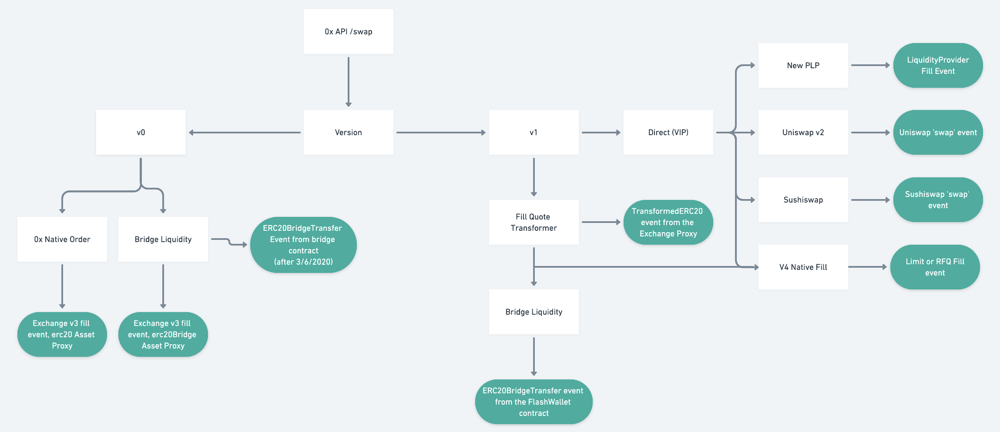

###############################
Events
###############################

This page defines 0x events emitted when interacting with the Exchange Proxy. The diagram below
illustrates how events are emitted when trading through the Exchange Proxy.

.. warning::
    There are pending upgrades that impact these events. Please see the `Releases <../additional/releases.html>`_ page for more details.

Event Catalogue
===============

This is a complete catalogue of 0x events emitted when interacting with the Exchange Proxy system of contracts.

.. note::
    This catalogue does not include events emitted by tokens or other exchanges, like Uniswap. It also only lists 0x V3 events
    that are emitted during a Fill; for an extensive list of V3 events, see the `V3 Spec <https://github.com/0xProject/0x-protocol-specification/blob/master/v3/v3-specification.md#events>`_.

.. _Deployed: #id1
.. _ERC20BridgeTransfer: #id2
.. _Fill: #id3
.. _MetaTransactionExecuted: #id4
.. _Migrated: #id5
.. _ProtocolFeeUnfunded: #id6
.. _ProxyFunctionUpdated: #id7
.. _QuoteSignerUpdated: #id8
.. _TransformedERC20: #id9
.. _TransformerMetadata: #id10

+-------------------------+--------------------------------------------------------------------------------------+---------------+
| Event                   | Description                                                                          | Emitted By    |
+-------------------------+--------------------------------------------------------------------------------------+---------------+
| Deployed_               | Emitted when a contract is deployed for use by the Exchange Proxy.                   | ExchangeProxy |
+-------------------------+--------------------------------------------------------------------------------------+---------------+
| ERC20BridgeTransfer_    | Emitted when a trade occurs.                                                         | FlashWallet   |
+-------------------------+--------------------------------------------------------------------------------------+---------------+
| Fill_                   | Emitted by Exchange V3 when an order is filled.                                      | Exchange V3   |
+-------------------------+--------------------------------------------------------------------------------------+---------------+
| MetaTransactionExecuted_| Emitted when a meta-transaction is executed on the Exchange Proxy.                   | ExchangeProxy |
|                         | Note that this differs from meta-transactions that are executed on Exchange V3.      |               |
+-------------------------+--------------------------------------------------------------------------------------+---------------+
| Migrated_               | Emitted when `ExchangeProxy.migrate()` is called.                                    | ExchangeProxy |
+-------------------------+--------------------------------------------------------------------------------------+---------------+
| ProtocolFeeUnfunded_    | Emitted when an order is skipped due to a lack of funds to pay the 0x Protocol fee.  | FlashWallet   |
+-------------------------+--------------------------------------------------------------------------------------+---------------+
| ProxyFunctionUpdated_   | Emitted when a function is upgraded via `extend()` or `rollback()`                   | ExchangeProxy |
+-------------------------+--------------------------------------------------------------------------------------+---------------+
| QuoteSignerUpdated_     | Emitted when `ExchangeProxy.setQuoteSigner()` is called.                             | ExchangeProxy |
+-------------------------+--------------------------------------------------------------------------------------+---------------+
| TransformedERC20_       | Emitted when the Transformer Deployer is upgraded.                                   | FlashWallet   |
+-------------------------+--------------------------------------------------------------------------------------+---------------+
| TransformerMetadata_    | A general, customizable event emitted that can be emitted by transformers as-needed. | FlashWallet   |
+-------------------------+--------------------------------------------------------------------------------------+---------------+

Deployed
--------

.. code-block:: solidity

    /// @dev Emitted when a contract is deployed via `deploy()`.
    /// @param deployedAddress The address of the deployed contract.
    /// @param nonce The deployment nonce.
    /// @param sender The caller of `deploy()`.
    event Deployed(address deployedAddress, uint256 nonce, address sender);

ERC20BridgeTransfer
-------------------
.. code-block:: solidity

    /// @dev Emitted when a trade occurs.
    /// @param inputToken The token the bridge is converting from.
    /// @param outputToken The token the bridge is converting to.
    /// @param inputTokenAmount Amount of input token.
    /// @param outputTokenAmount Amount of output token.
    /// @param from The bridge address, indicating the underlying source of the fill.
    /// @param to The `to` address, currrently `address(this)`
    event ERC20BridgeTransfer(
        IERC20TokenV06 inputToken,
        IERC20TokenV06 outputToken,
        uint256 inputTokenAmount,
        uint256 outputTokenAmount,
        address from,
        address to
    );

Fill
----
.. code-block:: solidity

    event Fill(
        address indexed makerAddress,         // Address that created the order.
        address indexed feeRecipientAddress,  // Address that received fees.
        bytes makerAssetData,                 // Encoded data specific to makerAsset.
        bytes takerAssetData,                 // Encoded data specific to takerAsset.
        bytes makerFeeAssetData,              // Encoded data specific to makerFeeAsset.
        bytes takerFeeAssetData,              // Encoded data specific to takerFeeAsset.
        bytes32 indexed orderHash,            // EIP712 hash of order (see LibOrder.getTypedDataHash).
        address takerAddress,                 // Address that filled the order.
        address senderAddress,                // Address that called the Exchange contract (msg.sender).
        uint256 makerAssetFilledAmount,       // Amount of makerAsset sold by maker and bought by taker.
        uint256 takerAssetFilledAmount,       // Amount of takerAsset sold by taker and bought by maker.
        uint256 makerFeePaid,                 // Amount of makerFeeAssetData paid to feeRecipient by maker.
        uint256 takerFeePaid,                 // Amount of takerFeeAssetData paid to feeRecipient by taker.
        uint256 protocolFeePaid               // Amount of eth or weth paid to the staking contract.
    );

Killed
------

.. code-block:: solidity

    /// @dev Emitted when a contract is killed via `kill()`.
    /// @param target The address of the contract being killed..
    /// @param sender The caller of `kill()`.
    event Killed(address target, address sender);

LimitOrderFilled
----------------
.. code-block:: solidity

    /// @dev Emitted whenever a `LimitOrder` is filled.
    /// @param orderHash The canonical hash of the order.
    /// @param maker The maker of the order.
    /// @param taker The taker of the order.
    /// @param feeRecipient Fee recipient of the order.
    /// @param takerTokenFilledAmount How much taker token was filled.
    /// @param makerTokenFilledAmount How much maker token was filled.
    /// @param pool The fee pool associated with this order.
    event LimitOrderFilled(
        bytes32 orderHash,
        address maker,
        address taker,
        address feeRecipient,
        address makerToken,
        address takerToken,
        uint128 takerTokenFilledAmount,
        uint128 makerTokenFilledAmount,
        bytes32 pool
    );

MetaTransactionExecuted
-----------------------

.. code-block:: solidity

    /// @dev Emitted whenever a meta-transaction is executed via
    ///      `executeMetaTransaction()` or `executeMetaTransactions()`.
    /// @param hash The meta-transaction hash.
    /// @param selector The selector of the function being executed.
    /// @param signer Who to execute the meta-transaction on behalf of.
    /// @param sender Who executed the meta-transaction.
    event MetaTransactionExecuted(
        bytes32 hash,
        bytes4 indexed selector,
        address signer,
        address sender
    );

Migrated
--------

.. code-block:: solidity

    /// @dev Emitted when `migrate()` is called.
    /// @param caller The caller of `migrate()`.
    /// @param migrator The migration contract.
    /// @param newOwner The address of the new owner.
    event Migrated(address caller, address migrator, address newOwner);

ProtocolFeeUnfunded
-------------------

.. code-block:: solidity

    /// @dev Emitted when a trade is skipped due to a lack of funds
    ///      to pay the 0x Protocol fee.
    /// @param orderHash The hash of the order that was skipped.
    event ProtocolFeeUnfunded(bytes32 orderHash);

ProxyFunctionUpdated
--------------------

.. code-block:: solidity

    /// @dev A function implementation was updated via `extend()` or `rollback()`.
    /// @param selector The function selector.
    /// @param oldImpl The implementation contract address being replaced.
    /// @param newImpl The replacement implementation contract address.
    event ProxyFunctionUpdated(bytes4 indexed selector, address oldImpl, address newImpl);

QuoteSignerUpdated
------------------
.. code-block:: solidity

    /// @dev Raised when `setQuoteSigner()` is called.
    /// @param quoteSigner The new quote signer.
    event QuoteSignerUpdated(address quoteSigner);

RfqOrderFilled
--------------
.. code-block:: solidity

    /// @dev Emitted whenever an `RfqOrder` is filled.
    /// @param orderHash The canonical hash of the order.
    /// @param maker The maker of the order.
    /// @param taker The taker of the order.
    /// @param takerTokenFilledAmount How much taker token was filled.
    /// @param makerTokenFilledAmount How much maker token was filled.
    /// @param pool The fee pool associated with this order.
    event RfqOrderFilled(
        bytes32 orderHash,
        address maker,
        address taker,
        address makerToken,
        address takerToken,
        uint128 takerTokenFilledAmount,
        uint128 makerTokenFilledAmount,
        bytes32 pool
    );

TransformedERC20
----------------

.. code-block:: solidity

    /// @dev Raised upon a successful `transformERC20`.
    /// @param taker The taker (caller) address.
    /// @param inputToken The token being provided by the taker.
    ///        If `0xeee...`, ETH is implied and should be provided with the call.`
    /// @param outputToken The token to be acquired by the taker.
    ///        `0xeee...` implies ETH.
    /// @param inputTokenAmount The amount of `inputToken` to take from the taker.
    /// @param outputTokenAmount The amount of `outputToken` received by the taker.
    event TransformedERC20(
        address indexed taker,
        address inputToken,
        address outputToken,
        uint256 inputTokenAmount,
        uint256 outputTokenAmount
    );

TransformerDeployerUpdated
--------------------------

.. code-block:: solidity

    /// @dev Raised when `setTransformerDeployer()` is called.
    /// @param transformerDeployer The new deployer address.
    event TransformerDeployerUpdated(address transformerDeployer);

TransformerMetadata
-------------------

.. code-block:: solidity

    /// @dev A transformer that just emits an event with an arbitrary byte payload.
    event TransformerMetadata(
        bytes32 callDataHash,
        address sender,
        address taker,
        bytes data
    );

